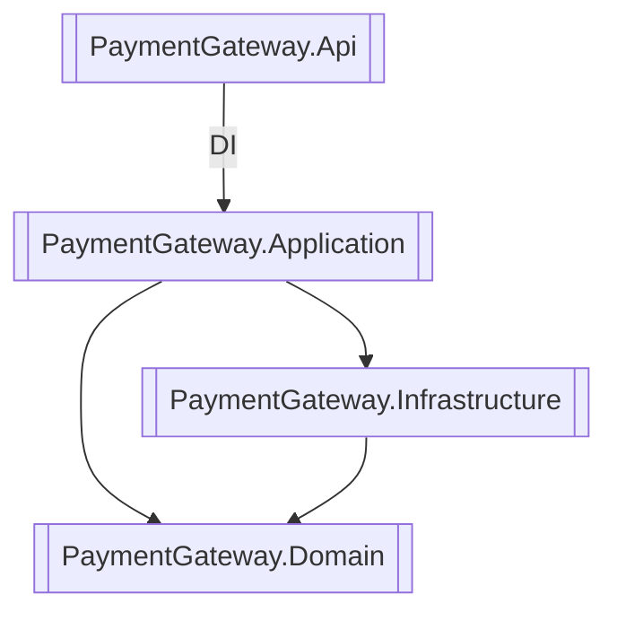

# Payment Gateway Web API

A reference implementation of a simple payment-processing backend written in **.NET 8** with clean-architecture style layering (Domain → Application → Infrastructure → API). The solution is entirely container-driven—no local SQL Server install required.

---

## Contents
1. [Features](#features)  
2. [Architecture](#architecture)  
3. [Prerequisites](#prerequisites)  
4. [Quick Start](#quick-start) – run everything with Docker Compose  
5. [Developer Workflow](#developer-workflow)  
6. [Automated Tests](#automated-tests)  
7. [Database Migrations](#database-migrations)  
8. [Configuration & Environment Variables](#configuration--environment-variables)  
9. [API Reference](#api-reference)  
10. [Health Checks](#health-checks)  
11. [CI Guidance](#ci-guidance)

---

## Features
* **Card verification**, **payment processing**, **refunds**, and **reports** (see *Application* layer).
* **JWT authentication** & HTTP **rate-limiting**.
* **Background service** that periodically performs automatic confirmations.
* **SQL Server 2022** database, managed via **EF Core 8** migrations.
* **Serilog** structured logging.
* **OpenAPI / Swagger UI** out-of-the-box.
* **Health checks** with liveness & readiness endpoints.
* **Deterministic test-suite**: Unit tests + Integration tests that spin their own disposable SQL container using **Testcontainers**.

---

## Architecture

* **Domain** – Entities & enums (no infrastructure concerns).
* **Application** – CQRS commands/queries + validation & business rules.
* **Infrastructure** – EF Core implementation, background services, external integrations.
* **API** – ASP.NET Core Web API + DI composition & middleware.

---

## Prerequisites
* **Docker Desktop** (or compatible Docker Engine)
* Optional for development: **.NET SDK 8.0** and **EF Core CLI** (`dotnet tool install --global dotnet-ef`)

No local SQL Server installation required.

---

## Quick Start
Spin up the full stack—API + SQL Server—in containers:

```bash
# From repository root
docker compose up --build
```

*API available at* **http://localhost:8080**
*Swagger UI*        **http://localhost:8080/swagger**

Compose file details:
* `paymentgateway_sql` – SQL Server 2022 with `sa` password `localdev!123` (change via env-var).
* `paymentgateway_api` – publishes the API, waits for DB healthy, auto-migrates schema on start-up.

Stop & clean containers:
```bash
docker compose down -v   # removes containers _and_ database volume
```

---

## Querying the Database
While the application is running via `docker compose up`, you can connect to the SQL Server container to inspect data.

**Connection Details:**
*   **Server:** `localhost,1433`
*   **Database:** `PaymentGateway`
*   **User:** `sa`
*   **Password:** `localdev!123`

Use any standard SQL client, such as the free **[Azure Data Studio](https://aka.ms/azuredatastudio-download)**.

---

## Developer Workflow
1. **Run tests first**  
   ```bash
   dotnet test               # spins Testcontainers SQL automatically
   ```
2. **Work on code** (requires .NET SDK). Hot-reload works via `dotnet watch run` once you set a connection string.
3. **Commit, push, open PR** – see CI guidance below.

---

## Automated Tests
| Layer | Project | What it does |
|-------|---------|--------------|
| Unit      | `PaymentGateway.Application.UnitTests`       | Pure .NET tests, no dependencies |
| Integration | `PaymentGateway.Api.IntegrationTests` | Boots the real HTTP pipeline against a disposable SQL container (Testcontainers) |

Run all:
```bash
dotnet test
```

---

## Database Migrations
Migrations live in **`src/PaymentGateway.Infrastructure/Migrations`**.

Create a new migration:
```bash
# Ensure ConnectionStrings:DefaultConnection points to a running SQL instance
export ConnectionStrings__DefaultConnection="Server=localhost;Database=PgDev;User Id=sa;Password=localdev!123;TrustServerCertificate=true;"

dotnet ef migrations add MyNewMigration -s src/PaymentGateway.Api -p src/PaymentGateway.Infrastructure
```

`Program.cs` runs `dbContext.Database.MigrateAsync()` at startup, so the schema updates automatically in every environment.

---

## Configuration & Environment Variables
| Key | Purpose | Default in docker-compose |
|-----|---------|---------------------------|
| `ASPNETCORE_ENVIRONMENT` | Sets environment (Development / Production) | `Development` |
| `ConnectionStrings__DefaultConnection` | EF Core connection string | `Server=db;Database=PaymentGateway;User Id=sa;Password=localdev!123;TrustServerCertificate=true;` |

> **Note:** Underscores (`__`) map to `:` in ASP.NET Core configuration binding.

---

## API Reference
Once running, open **Swagger UI** at `http://localhost:8080/swagger` for interactive docs.

Important routes:
* `POST /api/cards/validate` – verify card presence & details.
* `POST /api/payments`      – process a payment.
* `POST /api/payments/refund` – refund a payment.
* `GET  /api/reports/cards/balances` – card balances.
* `GET  /api/reports/payments`       – payment list.

All endpoints are protected by **JWT** except health checks; use the appropriate Bearer token or the **Test** authentication scheme in integration tests.

---

## Health Checks
| Endpoint | Description |
|----------|-------------|
| `/live`  | Liveness – does the process respond? |
| `/ready` | Readiness – confirms DB connectivity |

Both return 200 OK when healthy (JSON payload compatible with **HealthChecks.UI**).

---

## CI Guidance
A minimal GitHub Actions job:
```yaml
name: .NET
on: [push, pull_request]

jobs:
  test:
    runs-on: ubuntu-latest
    steps:
      - uses: actions/checkout@v4
      - uses: actions/setup-dotnet@v4
        with:
          dotnet-version: '8.0.x'
      - name: Run tests
        run: dotnet test --verbosity normal
```

*No Docker is required* in CI because Testcontainers uses the GitHub Actions host Docker daemon automatically.